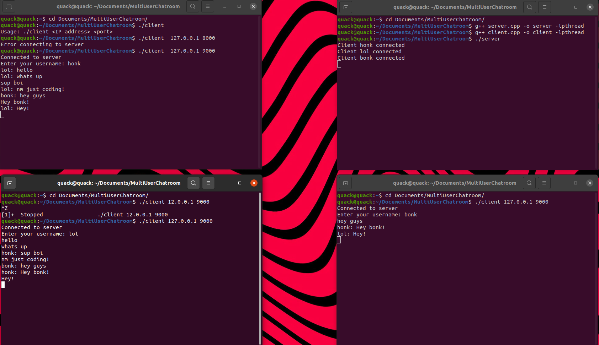

# MultiUserChatroom

This chatroom is made using C++ which implements the concepts of sockets, multi-threading and synchronization to prevent race conditions whenever shared resources are updated.



# How to run

1. Clone Repo
2. Run
```
g++ server.cpp -o server -lpthread
g++ client.cpp -o client -lpthread
```
3. In one terminal run
```
./server
```
4. In another terminal run
```
./client 127.0.0.1 9000
```
5. Enter your username and start chatting!